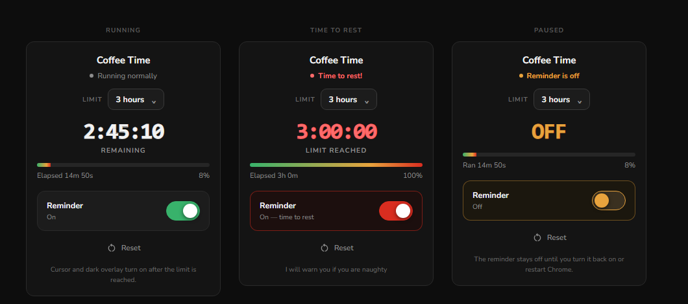

# Coffee Time

A Chrome/Chromium extension that reminds you to step away from the screen.

Set a time limit. Once Chrome has been running past it, every web page changes:
the cursor turns into a barista, the page darkens, and the tab title blinks
**Time to Rest**. Pause or reset it anytime from the popup.



## Features

- **Custom cursor** — replaceable image; ships with a barista illustration
- **Dark overlay** — the page dims and blurs slightly (no text, no interruption)
- **Blinking tab title** — alternates between the page title and `Time to Rest`
- **Toggle switch** — pause and resume the reminder with one click
- **Selectable limit** — 1 hour / 3 hours / 6 hours, defaults to 3 hours
- **Frozen clock while paused** — pausing genuinely stops the timer; the
  progress bar does not keep moving, and no elapsed time is lost on resume
- **Offline** — the font is self-hosted, no network requests at runtime

## Install

1. Download or clone this repository.
2. Open Chrome and go to `chrome://extensions`.
3. Enable **Developer mode** (toggle in the top-right corner).
4. Click **Load unpacked** (top-left) and select this folder.
5. Click the puzzle-piece icon in the toolbar and **pin** *Coffee Time*.

Works in any Chromium-based browser (Chrome, Edge, Brave, Opera).

## How it works

| State | What you see |
|---|---|
| Chrome just opened | Timer starts from 0, limit is 3 hours, page is untouched |
| Counting down | Popup shows the remaining time and a progress bar |
| Limit reached | Cursor changes, page darkens, tab title blinks |
| Switch off | Everything reverts; the clock freezes where it was |
| Switch on | The clock resumes from where it paused |
| Reset | Clock restarts from 0, current limit is kept |
| Chrome fully closed | Timer resets to 0 and the limit returns to 3 hours |

## Changing the time limit

Pick a value from the dropdown in the popup. Changing it restarts the clock
from zero immediately.

To edit the available choices, open `popup.html` and edit the
`<select id="limitSelect">` options. To change the default used on a fresh
session, edit `DEFAULT_LIMIT_MS` in `background.js`.

## Replacing the cursor image

The cursor is `cursor/cursor.png` — **128×128 px, transparent background**.

- Chrome caps cursors at 128×128. Anything larger is ignored and the cursor
  falls back to the default.
- **Use PNG, not WEBP.** Chrome does not reliably read `.webp` in the CSS
  `cursor: url(...)` property.
- The click hotspot is set to `6 6` in `content.js`. Adjust those two numbers
  if your image needs a different anchor point.
- Reload the extension afterwards, then open a **new tab** — an already-loaded
  page keeps the old cursor until it is refreshed.

## Replacing the icons and font

**Icons** — replace `icons/icon16.png`, `icon48.png`, and `icon128.png`.
Chrome caches extension icons aggressively; if the new one does not appear,
remove the extension and load it again.

**Font** — the UI uses Nunito (OFL licensed), self-hosted from
`fonts/nunito-latin-var.woff2`. Regenerate it with:

```bash
cd fonts
python build_fonts.py
```

Nunito ships as a *variable* font, so a single file covers every weight. Only
the latin subset is downloaded, which keeps the extension small.

The running timer deliberately uses a monospace stack instead, so the digits
do not shift as the seconds change.

## Project structure

```
manifest.json              Extension declaration (Manifest V3)
background.js              Timer, state, alarms — single source of truth
content.js                 Cursor, dark overlay, blinking tab title
popup.html / popup.js      Control panel (switch, limit dropdown, reset)
fonts/                     Self-hosted Nunito + generator script
cursor/                    Cursor images
icons/                     Extension icons
test_logic.js              Logic test suite (58 assertions)
```

## Architecture notes

All timing logic lives in one place: the `derive()` function in
`background.js`. It is a pure function of the stored state, and everything
else renders from its output.

```
launchTime  epoch ms when the current session's clock started
limitMs     the user's selected limit
stopped     whether the user paused the reminder
pausedAt    epoch ms when the pause happened

elapsed     stopped ? (pausedAt - launchTime) : (now - launchTime)
            capped at limitMs so the display stops at the limit

breakOn     !stopped && elapsed >= limitMs
```

The popup never computes state of its own — it sends a message and re-renders
from the snapshot the background returns. This avoids the two drifting apart.

Because a Manifest V3 service worker can be terminated at any time, no state
is cached in module-level variables; it is always read back from
`chrome.storage.local`.

## Development

No build step and no dependencies. Edit the source files and reload the
extension at `chrome://extensions`.

### Tests

`test_logic.js` mirrors the timing logic from `background.js` so it runs in
plain Node with no install:

```bash
node test_logic.js
```

58 assertions covering the countdown, the freeze at the limit, pause/resume
(including that already-used time is preserved), limit changes, and edge cases
such as a missing or future `launchTime`.

### Regenerating the font

```bash
cd fonts && python build_fonts.py
```

### README screenshot

`docs/popup-preview.html` is a static mockup of the three popup states, used to
render `docs/popup.png`. It is not part of the extension.

## Limitations

- Does not run on `chrome://` pages, the Chrome Web Store, or the built-in PDF
  viewer — a browser restriction, not a bug.
- Uses `chrome.alarms`, which has a 30-second minimum resolution in MV3, so the
  visuals can appear up to 30 seconds after the limit is reached on an idle
  browser. Opening a new tab applies the visuals immediately.

## Credits

- Cursor and icon artwork: project assets
- Font: [Nunito](https://fonts.google.com/specimen/Nunito) by Vernon Adams,
  Cyreal, and Jacques Le Bailly — SIL Open Font License 1.1
- Reset icon: Material Symbols (Apache License 2.0)

## License

MIT — see [LICENSE](LICENSE).

## Tip

SOL : DcjLpDVQ79zVTLhnCLWWrVdTtYvoQJZq2vWkhBHg3RN9
